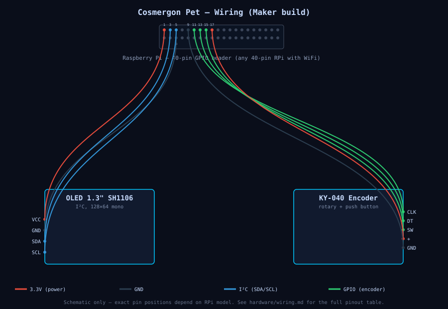

# Wiring — Maker & Complete build

Same pinout for both variants (they use the same parts). Seven cables,
no soldering, all female-to-female Dupont connectors plug onto the RPi
40-pin GPIO header.



Regenerate with: `python3 scripts/generate-wiring-svg.py`.

## OLED Display (4 cables)

```
OLED          RPi 40-pin header      GPIO / function
────────────────────────────────────────────────────
VCC    →      Pin 1                  3.3 V
GND    →      Pin 6                  Ground
SDA    →      Pin 3                  GPIO 2 (I²C SDA)
SCL    →      Pin 5                  GPIO 3 (I²C SCL)
```

## KY-040 Rotary Encoder (5 cables)

```
Encoder       RPi 40-pin header      GPIO / function
────────────────────────────────────────────────────
CLK    →      Pin 11                 GPIO 17
DT     →      Pin 13                 GPIO 27
SW     →      Pin 15                 GPIO 22          (push button)
+      →      Pin 17                 3.3 V
GND    →      Pin 9                  Ground
```

## Why these pins?

- **I²C** (OLED) must go on GPIO 2/3 — those are the hardware I²C lines.
- **Encoder** is on free GPIOs (17, 27, 22) that don't conflict with
  SPI, serial or the camera interface. Easy to remap in `face.py` if
  you need them for something else.

## Shared pins

The RPi has multiple 3.3 V pins (1, 17) and multiple ground pins
(6, 9, 14, 20, 25, 30, 34, 39). You can share them — the table above
picks distinct pins only so you don't have to twist two wires into
one pin.

## ASCII overview

```
  RPi 40-pin header (top-down, looking at the Pi)
  Pin 1  [●] [●]  Pin 2
  Pin 3  [●] [●]  Pin 4     Pin 1  = 3.3V   → OLED VCC
  Pin 5  [●] [●]  Pin 6     Pin 3  = SDA    → OLED SDA
  Pin 7  [●] [●]  Pin 8     Pin 5  = SCL    → OLED SCL
  Pin 9  [●] [●]  Pin 10    Pin 6  = GND    → OLED GND
  Pin 11 [●] [●]  Pin 12    Pin 9  = GND    → Encoder GND
  Pin 13 [●] [●]  Pin 14    Pin 11 = GPIO17 → Encoder CLK
  Pin 15 [●] [●]  Pin 16    Pin 13 = GPIO27 → Encoder DT
  Pin 17 [●] [●]  Pin 18    Pin 15 = GPIO22 → Encoder SW
   …      …   …    …        Pin 17 = 3.3V   → Encoder +
```

## Sanity check after wiring

Before the Pet software starts:

```bash
# I²C devices should show the OLED (0x3C or 0x3D)
sudo i2cdetect -y 1

# Expected output fragment:
#      0  1  2  3  4  5  6  7  8  9  a  b  c  d  e  f
# 00:                                        3c -- -- --
```

If the OLED's address doesn't show up:

- Check VCC and GND (OLED needs power, obviously)
- Check SDA/SCL (Pin 3 / Pin 5 are the I²C lines — don't confuse with
  Pin 2 / Pin 4 which are 5 V and GND)
- Press the connectors firmly — Dupont cables sometimes sit half-loose

## Encoder direction

KY-040 produces two steps per detent (well-known quirk). The Pet
software compensates — scrolling should feel right out of the box.
If it doesn't, swap CLK ↔ DT and try again.

## Adding a buzzer, LED, …

Want to add a status LED or a buzzer that triggers on `action!`?
GPIOs 23, 24, 25 are free and adjacent to the ones we use. A PR that
adds optional peripherals is welcome — keep them **optional** so
minimal builds still work.
